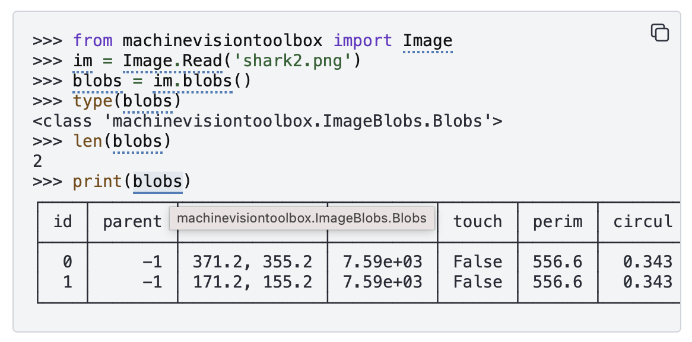

sphinx-pyrunblock
==================

.. image:: ../figs/pyrunblock-logo.svg
   :align: center
   :width: 350
   :alt: sphinx-pyrunblock

``sphinx-pyrunblock`` is a Sphinx extension that executes code from a
``runblock`` directive and inserts the real output into your documentation.
For example::

    .. runblock:: pycon

        >>> for i in range(5):
        ...    print(i)

renders in the document as:

.. runblock:: pycon

    >>> for i in range(5):
    ...    print(i)

.. toctree::
   :maxdepth: 2
   :caption: Contents:

   configuration
   about

Installation
------------

.. code-block:: console

    $ pip install sphinx-pyrunblock

Enable the extension by adding it to the ``extensions`` list in ``conf.py``:

.. code-block:: python

    extensions = [
        "sphinx_pyrunblock",
    ]

See :doc:`configuration` for the full ``conf.py`` reference.

Worked examples
----------------

.. runblock:: pycon

   >>> from spatialmath.base import trnorm, troty
   >>> from numpy import linalg
   >>> T = troty(45, 'deg', t=[3, 4, 5])
   >>> linalg.det(T[:3,:3]) - 1 # is a valid SO(3)
   >>> T = T @ T @ T @ T @ T @ T @ T @ T @ T @ T @ T @ T @ T
   >>> linalg.det(T[:3,:3]) - 1  # not quite a valid SE(3) anymore
   >>> T = trnorm(T)
   >>> linalg.det(T[:3,:3]) - 1  # once more a valid SE(3)

.. runblock:: pycon

   >>> from spatialmath.base import qconj, qprint
   >>> q = [1, 2, 3, 4]
   >>> qprint(qconj(q))

Per-block options
------------------

Options are given on the directive itself, and apply to that one block only
(compare :doc:`configuration` for options that apply document-wide, via
``conf.py``):

``:linenos:``
    Show line numbers in the rendered code block.

``:include: start-end``
    Only render lines in the given range of the block's *output* (line
    numbers count the block's own statements, not the configured
    ``runfirst`` code, which never appears in output).

``:exclude: start-end``
    Skip lines in the given range, same numbering as ``:include:``.

``:numpy:``
    Prepend ``import numpy as np`` before the block runs.

``:scipy:``
    Prepend ``import scipy as sp`` before the block runs.

``:smtb:``
    Append ``from spatialmath import *`` before the block runs.

``:precision: N``
    Append ``np.set_printoptions(precision=N)`` before the block runs.
    Requires numpy to already be imported (via ``:numpy:`` or a configured
    ``runfirst`` -- see :doc:`configuration`).

More examples
-------------

.. runblock:: pycon
   :include:  5-10

      >>> from spatialmath.base import getunit
      >>> import numpy as np
      >>> getunit(1.5, 'rad')
      >>> getunit(90, 'deg')
      >>> getunit(90, 'deg', vector=False) # force a scalar output
      >>> getunit(1.5, 'rad', dim=0) # check argument is scalar
      >>> getunit(1.5, 'rad', dim=3) # check argument is a 3-vector
      >>> getunit([1.5], 'rad', dim=1) # check argument is a 1-vector
      >>> getunit([1.5], 'rad', dim=3) # check argument is a 3-vector
      >>> getunit(90, 'deg')
      >>> getunit([90, 180], 'deg')
      >>> getunit(np.r_[0.5, 1], 'rad')
      >>> getunit(np.r_[90, 180], 'deg')
      >>> getunit(np.r_[90, 180], 'deg', dim=2)
      >>> getunit([90, 180, 270], 'deg', dim=3)

For any construct with an indented body (``for``, ``while``, ``with``), it's
important to put a blank line on the end. That will be stripped off and
won't appear in the output.

.. runblock:: pycon
   :numpy:

   >>> from spatialmath.base import getunit
   >>> getunit(1.5, 'rad')
   >>> try:
   >>>   getunit(1.5, 'rad', dim=0)
   >>> except Exception as e:
   >>>   print(f"EXCEPTION {e}")
   >>>
   >>> for i in range(5):
   >>>    print(i)
   >>>

Lines ending with ``# ignore`` are executed but not shown in the rendered
output -- useful for setup code that would otherwise clutter the example.

The REPL prompt (``>>>``) is actually optional, and can be omitted if you are cutting
and pasting chunks of code from elsewhere::
    
    .. runblock:: pycon

        a = 2
        print(a**3)

will render as:

.. runblock:: pycon

   a = 2
   print(a**3)
    
Note that indentation cannot be expressed in this mode since all white space is stripped
from the start of each line.  If you want to include indented code, use the REPL prompt
style.

If you prefer the examples to look like a script rather than a REPL session you can
suppress the output prompts and continuation lines by using the ``:no-prompt:`` option::

    .. runblock:: pycon
        :no-prompt:

        a = 2
        print(a**3)

will render as:

.. runblock:: pycon
    :no-prompt:

    a = 2
    print(a**3)

Block output appears as a comment line to clearly distinguish it from the lines of input code. 
This means you can cut and paste the code into a Python interpreter and it will run without modification.

Other code documentation tools
==============================

.. raw:: html

    

Note the copy/paste button in the top right corner of the code block, the links on
the names in the code and the hoverbox showing object type.  These are provided by two other Sphinx extensions.

Easy copy-paste of code
-----------------------

Copying text straight out of a rendered code block normally picks up the
``>>> ``/``... `` prompts and any output lines along with it, so pasting it
back into a file or interpreter either fails outright or pastes lines you
never wanted. The `sphinx-copybutton
<https://sphinx-copybutton.readthedocs.io/>`__ extension adds a
copy-to-clipboard button to every code block (see above) and can be configured to strip
prompts on copy, so a reader always gets clean, runnable code regardless of
whether the block was written with prompts or ``:no-prompt:``.

.. code-block:: console

    $ pip install sphinx-copybutton

.. code-block:: python

    extensions = [
        "sphinx_pyrunblock",
        "sphinx_copybutton",
    ]

    # Strip >>> / ... prompts (and shell $ prompts) when the copy button is
    # used; keep output lines in the copied text rather than filtering them
    # out (also representative of what Peter's other toolboxes use).
    copybutton_prompt_text = r">>> |\.\.\. |\$ "
    copybutton_prompt_is_regexp = True
    copybutton_only_copy_prompt_lines = False
    copybutton_remove_prompts = True

A ``:no-prompt:`` block has no prompts for copybutton to strip in the first
place, so it's already copy-paste-ready without any of this -- the button
is mainly what makes REPL-style blocks pasteable too.

Cross-linking names to their documentation
--------------------------------------------

``sphinx-pyrunblock`` only executes code and renders output -- it doesn't
know anything about turning the names in an example into links. That's a
separate, complementary extension:
`sphinx-codeautolink <https://sphinx-codeautolink.readthedocs.io/>`__. It
statically analyses each code block's AST, tracks types through variable
assignments and chained method calls, and:

* hyperlinks each resolved name to its ``autodoc``-generated (or intersphinx) documentation page,
* adds a cursor hoverbox showing the type of the variable name under the cursor.

The two extensions don't know about each other, and don't need to --
``sphinx-codeautolink`` works by scanning the *built* HTML for code blocks
by CSS class (``highlight-pycon``, ``highlight-python``, etc.), matched
against source it separately parsed from the doctree. Since ``runblock``
sets the block's language to ``pycon`` (or ``python``, under
``:no-prompt:``), any ``runblock`` example gets cross-linked automatically
once ``sphinx-codeautolink`` is installed and enabled -- no special
integration required on either side.

.. code-block:: console

    $ pip install sphinx-codeautolink

.. code-block:: python

    extensions = [
        "sphinx_pyrunblock",
        "sphinx_codeautolink",
    ]

    from sphinx_codeautolink import clean_pycon

    # "python" (used by :no-prompt: blocks) is recognised natively; pycon
    # console syntax needs its prompts cleaned before the block can be
    # parsed as Python, hence this entry.
    codeautolink_custom_blocks = {"pycon": clean_pycon}

Require ``sphinx-codeautolink>=0.19.0``. Earlier versions don't resolve
``Self``-typed return annotations (`PEP 673
<https://peps.python.org/pep-0673/>`__), which is the standard return
annotation for fluent/factory-style methods (``obj = Klass.create(...)``)
-- without the fix, cross-linking silently stops for anything chained off
a call to one of those, with no warning by default.

Error reporting
===============

If the code raises an exception, a diagnostic marker is written to the
Sphinx build log and a short error summary is embedded in the rendered
output:

.. code-block:: text

    >>> img.metadata('FocalLength')
    !! [RUNBLOCK-ERROR] machinevisiontoolbox/ImageIO.py:236
        KeyError: 'FocalLength'

The build log entry is more detailed:

.. code-block:: text

    !! [RUNBLOCK-ERROR] source/numpy.rst:98
        ModuleNotFoundError: No module named 'machinevisionToolbox'
        Traceback (most recent call last):
          File "<input>", line 1, in <module>
        ModuleNotFoundError: No module named 'machinevisionToolbox'

The marker line appears **before** the traceback so failures are easy to
scan in a long build log. The source location (``file:line``) refers to the
``.rst`` file, or the Python source file containing the docstring where the
``runblock`` directive lives.

A syntax error in the code block is reported the same way:

.. code-block:: text

    >>> print(("Hello, world")
    !! [RUNBLOCK-ERROR] source/api.rst:42
        SyntaxError: '(' was never closed
